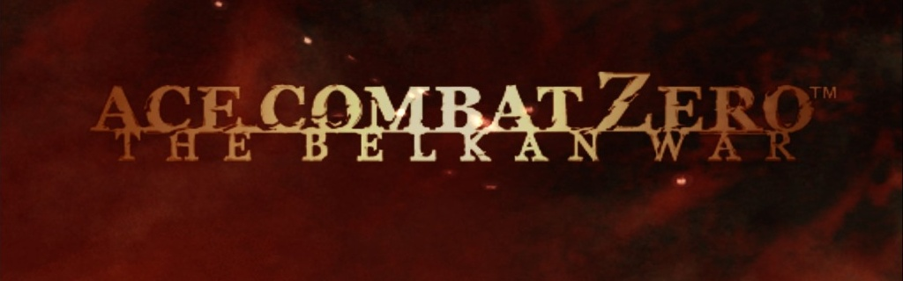

# Ace Combat Save Tools

[English](README.md) | [简体中文](README.zh-CN.md)



Local, offline tools and a reusable Copilot skill for ACE COMBAT ZERO save analysis.
This is an unofficial project, not affiliated with the publisher.

## Tested version

Checked locally on **2026-10-07**:

| Item | Verified value |
| --- | --- |
| Executable | `acz.exe` |
| File / product version | **1.0.2.1** |
| Installed Steam package Build ID | **25201480** |
| Decoded save layout | **86,960 bytes** |
| Game-loading tests | Slots **1 and 2**; slot 3 offline-tested only |

**Only this version and installation were tested. Compatibility with other
versions, regions, distributions, or future updates is not guaranteed.**
The Steam Build ID identifies the installed package, not a second executable
version. Identical version strings do not establish byte-for-byte compatibility.

## Included

- ACZero PC save decoder/editor: money and aircraft purchase eligibility.
- [Reusable Copilot skill](.github/skills/ace-combat-save-editing/SKILL.md).
- [Format findings and validation boundaries](docs/FORMAT.md).

ACZero money and all 36 aircraft purchase flags were verified by loading edited
saves in the game. Ownership and campaign progress were preserved. The supported
decoded layout is 86,960 bytes. The tool now addresses all three campaign slots;
**slots 1 and 2 are game-verified; slot 3 awaits game-loading validation**.
Other builds are not guaranteed.

## In-game proof

On 2026-10-07, a new **FILE 02** campaign at Mission 01 was edited without
advancing its campaign progress. After reloading, **ADF-01 FALKEN was available
for purchase and the balance displayed 1,000,000**.

| Before | After |
| --- | --- |
|  |  |

The before image shows **0 balance** and **8,500 aircraft price**, not 8,500
cash. The after image shows 1,000,000 cash, a 430,000 FALKEN price, and 570,000
projected cash after purchase; it demonstrates purchase eligibility, not ownership.

[Full evidence sequence and limitations](docs/VALIDATION.md)

## Setup

Python 3.13 was used for validation. Windows is required for `--apply`.

```powershell
python -m pip install -r requirements.txt
$tool = '.github\skills\ace-combat-save-editing\scripts\aczero_save.py'
$save = 'C:\Program Files (x86)\Steam\userdata\<accountid>\2288340\remote\aczero\save\save.sav'

# List all three slots and validate; does not modify the source.
python $tool --source $save

# Inspect slot 2 in detail.
python $tool --source $save --slot 2

# Generate a candidate for an existing slot before replacing the real save.
python $tool --source $save --slot 2 --unlock-aircraft

# Close the game. This creates and verifies a same-directory ZIP backup.
python $tool --source $save --slot 2 --unlock-aircraft --apply

# Set the total balance to one million, not an increment.
python $tool --source $save --slot 2 --set 1000000 --apply
```

Replace the example Steam root and `<accountid>` with your actual values.
`--account-id` is the owning account's 32-bit folder ID, not a SteamID64.
Supply it explicitly when analyzing a copy outside the standard Steam layout.
`--amount` searches for a number; only `--set` changes money.
The tool does not guess which slot is active in the game.

## Three-slot workflow

The JSON output includes `slots_before` and `slots_after`, each with:
`slot`, `state`, `money`, `available_aircraft`, and `owned_aircraft_ids`.
`state` is `occupied`, `empty`, or `unknown`. Empty/unrecognized slots show
`null` values rather than misleading balances. On read-only runs without
`--slot`, all slots are listed and detailed legacy fields refer to slot 1.

Every money/unlock edit requires an explicit `--slot 1`, `--slot 2`, or
`--slot 3`, even when only generating a candidate. Empty and unrecognized
slots are refused; initialize them by starting and saving a campaign in the
game, not by fabricating occupancy flags.
Other slot records and the shared header are checked byte-for-byte unchanged.
Only the selected slot's requested fields and the required checksums change.

For any slot, first verify the reported balance against the game's save
selection screen, make a small money edit, reload that slot, and confirm the
other two slots are unchanged. Keep the ZIP backup until game validation is
complete. Three-slot support is based on the serialized layout and offline
validation, with game confirmation for slots 1 and 2. Slot 3 remains unconfirmed
in the game.

Without `--apply`, the source is unchanged. Outputs go to a fresh temporary
directory unless `--output-dir` is supplied. Logs and JSON results contain local
paths and save hashes: do not publish them without reviewing/redacting them.

## Safety and restoration

Close the game before replacing or restoring a save. The tool verifies both
checksums, restricts decoded changes, verifies ZIP backups, checks for source
changes, and replaces through a same-directory temporary file.
Run a fresh read-only decode after applying, then load the save in the game.
Restore by extracting the chosen ZIP's save file into its original directory
with the game closed. Steam Cloud can overwrite local saves; resolve conflicts
deliberately. Do not edit cloud metadata blindly.

Aircraft unlocking grants purchase eligibility, not ownership or free purchases.
It does not unlock weapons, colors, medals, or reconstruct a completed campaign.
Money and unlock operations can be combined only when both are intended.

## Offline regression checks

```powershell
python tests\validate_slots.py
```

The 19 CLI checks use synthetic data only and cover all three slots, money and
purchase eligibility (separate and combined), non-target-slot preservation,
explicit slot selection, empty/unknown rejection, and the no-mission sentinel.
They neither read nor write your real save, and use automatically cleaned
temporary files. These checks do not replace game-loading validation.

## Privacy

This repository contains no game saves, game binaries, memory dumps, account
IDs, private paths, credentials, or recorded per-user save hashes.
All processing is local; the script has no network upload functionality.
Evidence images have metadata removed, and local command/path lines in the
request screenshot are redacted.
Never commit generated artifacts or backup archives.

## Research use and rights

For lawful research, learning, and authorized personal offline experimentation
only. Do not use it to infringe copyright, distribute unauthorized game content,
evade licensing/access controls, manipulate other people's data, cheat online,
or harm rights holders, users, or services. Respect applicable law and agreements.

Game names, trademarks, artwork, and supplied screenshots belong to their
respective rights holders; this project claims no endorsement or ownership.
The tool is provided **as is**, without compatibility or data-loss guarantees;
back up first and test deliberately. A disclaimer is not permission for unlawful
use and cannot override mandatory legal rights or duties.

Read the [full bilingual disclaimer](docs/DISCLAIMER.md) before use.
