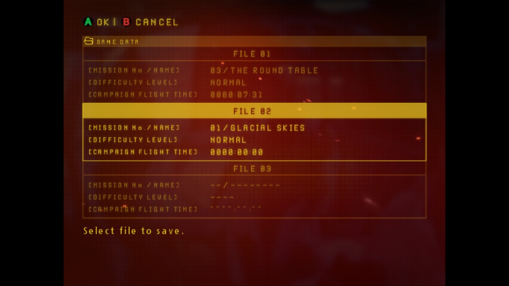
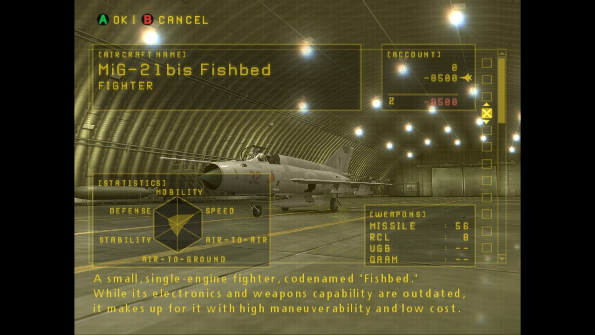
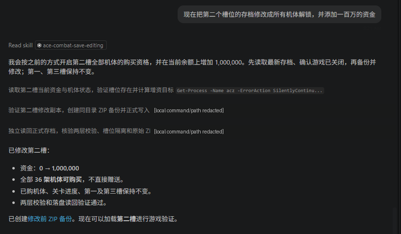
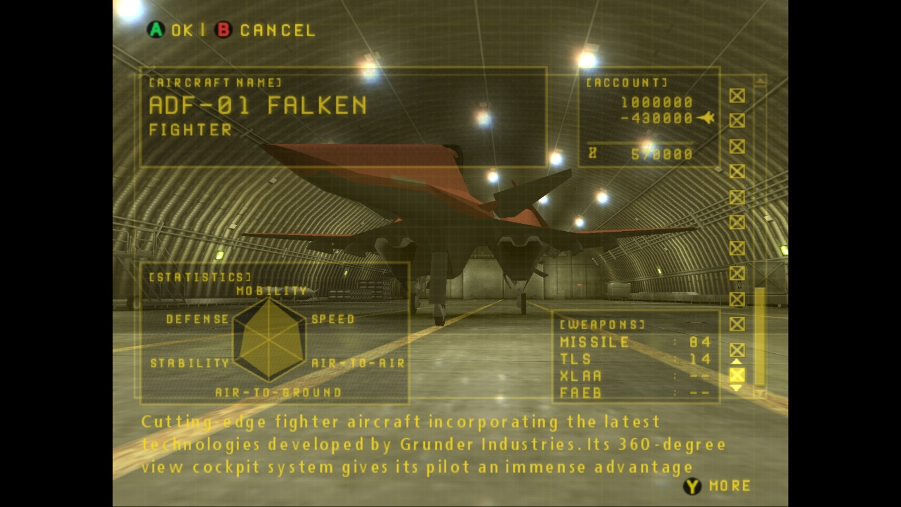

# ACZero 第二存档槽：游戏内验证

验证日期：2026-10-07。截图由使用者提供，用于展示本地存档修改后的实际游戏表现。
工具离线检查与游戏截图互为补充，不将工具的成功报告当作游戏加载证据。

本机核对的 `acz.exe` 文件／产品版本为 **1.0.2.1**，Steam 安装包
Build ID 为 **25201480**。只在这个版本及安装环境完成验证；
Steam Build ID 不等于程序版本，也不保证其他更新、地区或发行版本可用。
本机版本读取是文件元数据和安装清单核对，不依赖截图猜测。
使用前请阅读[研究用途与权利免责声明](DISCLAIMER.md)。

## 结论与证据边界

- **第二槽 FILE 02** 新战役在第一关 `01 / GLACIAL SKIES`，难度 NORMAL。
- 修改前解码余额为 **0**；修改后增加 **1,000,000**，总余额为 **1,000,000**。
- 工具将第二槽 36 个机型的购买资格设为可用；未直接授予飞机所有权。
- 重载后截图显示 **ADF-01 FALKEN 可以在商店预览购买**，资金显示 **1,000,000**。
- 工具逐字节核验第一、第三槽以及目标槽的非目标字段不变，内外校验通过，
  除余额和购买资格外，已拥有机体及关卡进度均保持原值；未伪造一周目通关。
- 截图直接证明资金显示和 FALKEN 购买资格；**单张商店截图不证明逐架购买成功，
  也不单独证明所有 36 架飞机、其他槽或全部任务记录**。这些保留项依据离线比对。
- 第一、第二槽已有游戏加载验证，第三槽仍待验证。

## 1. 新建并保存第二槽

FILE 02 显示 `01 / GLACIAL SKIES`、NORMAL、`0000:00:00`。
同一画面中 FILE 01 已在第三关，FILE 03 为空，便于区分三个槽位。
这是保存槽选择界面，证明实验使用新建的第二槽，而不是覆盖第一槽进度。

## 2. 修改前：初始飞机商店

图中选择的是 **MiG-21bis Fishbed**。ACCOUNT 显示当前余额 **0**，
`-8500` 是所选飞机的购买报价／预览扣款，红色 `-8500` 是预计购买后资金，
不是拥有 8,500 资金。

使用者说明此时第一关只有初始机型；工具读取第二槽为 4 个可购买机型，
已拥有机型保持原有 3 个。此图展示一个初始机型的购买界面，
不将它误称为完整机型列表截图。

## 3. 修改请求与工具执行记录

请求范围是第二槽机体解锁及增加一百万资金。执行中解释为：
**全部机体可购买，仍需支付价格；在现有资金上加一百万**。
余额原值为零，因此目标余额为一百万。

同目录 ZIP 备份验证后，工具重算内外校验并原子替换存档，再独立读回校验。
此图只是请求与执行报告，不代替下一张游戏内实测证据。
其中两行包含本机命令和路径，已用不透明遮挡脱敏；输入框和模型界面已裁去。

## 4. 修改后：第一关可购买 FALKEN，余额一百万

- 所选飞机：**ADF-01 FALKEN**。
- 当前余额：**1,000,000**。
- 预览购买价格：**430,000**。
- 预计购买后余额：**570,000**。

此时仍是新战役第一关。截图表现为购买预览，说明隐藏飞机的购买资格已开放，
而非工具免费赠送飞机。第一关的上下文来自使用者描述及修改前记录，
该张商店截图本身没有任务编号。

## 图像整理与脱敏说明

附件先按原名复制到仓库，再重命名和处理；使用者提供的原附件未改动。
游戏证据 JPG 保留完整画面和黑边，只移除元数据，解码像素不变。
标题图另生成 `1024 × 320` banner，仅作页面装饰，不属于修改有效性证据。
指令截图只裁剪外围并遮挡本机命令／路径，不改变指令或修改结果文字。

| 原文件名 | 仓库文件名 | 用途／处理 |
| --- | --- | --- |
| `20261007081800_1.jpg` | `images/aczero-title-screen.jpg` | 标题完整图，移除元数据 |
| 同上派生 | `images/aczero-banner.jpg` | 裁剪标题生成 README banner |
| `20261007081941_1.jpg` | `images/slot-02-new-campaign.jpg` | 第二槽新建记录 |
| `20261007081924_1.jpg` | `images/slot-02-before-initial-aircraft.jpg` | 修改前初始机商店 |
| `QQ_1791332553730.png` | `images/slot-02-agent-request-redacted.png` | 指令和执行摘要，裁剪与路径脱敏 |
| `20261007082618_1.jpg` | `images/slot-02-after-falken-and-funds.jpg` | 修改后 FALKEN 与资金 |

游戏画面及商标属于各自权利人。这些使用者提供的截图只用于演示和验证，
仓库不包含游戏程序、游戏资源包、原始存档、账号 ID、凭据或内存快照。
